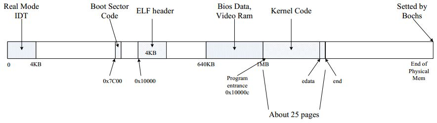
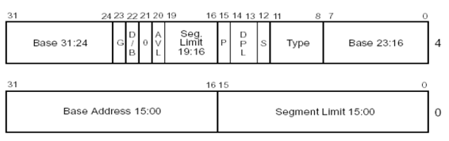

# Lab2: Memory Management
[guide link](https://pdos.csail.mit.edu/6.828/2018/labs/lab2/)
## Introduction
Writing memory management code for our OS, memory management have two components:
1. physical memory allocator for kernel, so that the kernel can allocate memory and later free it.
2. virtual memory, which maps the virtual address used by kernel and user software to address in physical memory.

## Getting started
```sh
cd lab 
git checkout -b lab2 origin/lab2
```
## Part 1: Physical Page Management

JOS manages the PC's physical memory with `page` granularity, and use the MMU to map and protect each piece of allocated memory.

Let's review this booting process. OS loads the bootsector to 0x7c00 first sets the environment, then call to bootmain in c code. bootmain loads the kernel and call into kernel entry. Kernel loads entry_pgdir to cr3 to enable Paging, then call `i386_init`. i386_init Clear the BSS, call `cons_init()` to set up the screen display device and making it ready for cprintf to run, then call `mem_init()`. Finally call `monitor()` to interact with users.

Before calling to i386_int(), the memory distribution is shown in the figure below:



Now need to write **physical page allocator**, which keeps track of which pages are free with a linked list of `struct Pageinfo` objects(`memlayout.h` line 175). A object corresponding to a physical page.

### Exercise 1
In the file `kern/pmap.c`, you must implement code for the following functions (probably in the order given).
> 
> boot_alloc()
> 
> mem_init() (only up to the call to check_page_free_list(1))
> 
> page_init()
> 
> page_alloc()
> 
> page_free()
> 
> check_page_free_list() and check_page_alloc() test your physical page allocator. 

**boot_alloc()**

boot_alloc() use a magic symbol `end` to get BSS tail which pointe to first free memory.

`ROUNDUP(n, M)` returns a num that satisfy `num % M == 0 && M >= num >= n`

```c
boot_alloc(uint32_t n)
{
	static char *nextfree;	// virtual address of next byte of free memory
	char *result;

	// Initialize nextfree if this is the first time.
	// 'end' is a magic symbol automatically generated by the linker,
	// which points to the end of the kernel's bss segment:
	// the first virtual address that the linker did *not* assign
	// to any kernel code or global variables.
	if (!nextfree) {
		extern char end[];
		nextfree = ROUNDUP((char *) end, PGSIZE);	// round end up to PGSIZE
	}

	// Allocate a chunk large enough to hold 'n' bytes, then update
	// nextfree.  Make sure nextfree is kept aligned
	// to a multiple of PGSIZE.
	//
	// LAB 2: Your code here.
	if(n == 0)
		return nextfree;		// if n == 0, return nextfree, not allocate any memory.
	result = nextfree;
	nextfree += ROUNDUP(n, PGSIZE);		// align to PGSIZE
	return result;
}
```

**mem_init()**

Need to use `PageInfo` in `/inc/memlayout.h`


```c
struct PageInfo {
	// Next page on the free list.
	struct PageInfo *pp_link;

	// pp_ref is the count of pointers (usually in page table entries)
	// to this page, for pages allocated using page_alloc.
	// Pages allocated at boot time using pmap.c's
	// boot_alloc do not have valid reference count fields.

	uint16_t pp_ref;
};
```

code as discribe:

```c
//////////////////////////////////////////////////////////////////////
	// Allocate an array of npages 'struct PageInfo's and store it in 'pages'.
	// The kernel uses this array to keep track of physical pages: for
	// each physical page, there is a corresponding struct PageInfo in this
	// array.  'npages' is the number of physical pages in memory.  Use memset
	// to initialize all fields of each struct PageInfo to 0.
	// Your code goes here:
	pages = (struct PageInfo*) boot_alloc(npages * sizeof(struct PageInfo));
	memset(pages, 0, npages * sizeof(struct PageInfo));
```

**page_init**

```c
void
page_init(void)
{
	// The example code here marks all physical pages as free.
	// However this is not truly the case.  What memory is free?

	//  1) Mark physical page 0 as in use.
	//     This way we preserve the real-mode IDT and BIOS structures
	//     in case we ever need them.  (Currently we don't, but...)
	pages[0].pp_ref = 1;
	//  2) The rest of base memory, [PGSIZE, npages_basemem * PGSIZE)
	//     is free.
	size_t i;
	for (i = 1; i < npages_basemem; i++) {
		pages[i].pp_ref = 0;
		pages[i].pp_link = page_free_list;
		page_free_list = &pages[i];
	}
	//  3) Then comes the IO hole [IOPHYSMEM, EXTPHYSMEM), which must
	//     never be allocated.
	for(i = IOPHYSMEM/PGSIZE, i < EXTPHYSMEM/PGSIZE, i++) {
		pages[i].pp_ref = 1;
	}
	//  4) Then extended memory [EXTPHYSMEM, ...).
	//     Some of it is in use, some is free. Where is the kernel
	//     in physical memory?  Which pages are already in use for
	//     page tables and other data structures?
	size_t first_free = PADDR(boot_alloc(0));
	for(i = EXTPHYSMEM/PGSIZE, i < first_free/PGSIZE, i++) {
		pages[i].pp_ref = 1;
	}
	for(i = first_free/PGSIZE; i < npages, i++) {
		pages[i].pp_ref = 0;
		pages[i].pp_link = page_free_list;
		page_free_list = &pages[i];
	}
	//
	// Change the code to reflect this.
	// NB: DO NOT actually touch the physical memory corresponding to
	// free pages!
}
```

**page_alloc()**

```c
struct PageInfo *
page_alloc(int alloc_flags)
{
	// Fill this function in
	if(page_free_list == NULL) {
		return NULL;
	}
	
	struct PageInfo* allocated_page = page_free_list;
	page_free_list = page_free_list->pp_link;

	allocated_page->pp_link = NULL;

	if(alloc_flags & ALLOC_ZERO) {
		memset(page2kva(allocated_page), '/0', PGSIZE);
	}

	return allocated_page;
}
```

**page_free()**

```c
void
page_free(struct PageInfo *pp)
{
	// Fill this function in
	// Hint: You may want to panic if pp->pp_ref is nonzero or
	// pp->pp_link is not NULL.
	if(pp->pp_ref != 0 || pp->pp_link != NULL) {
		panic("Double check failed when free page");
		return;
	}

	pp->pp_link = page_free_list;
	page_free_list = &pp;
}
```

## Part2: Virtual Memory

### Exercise2 familiarize  x86's protected-mode memory management architecture
Look at chapters 5 and 6 of the Intel 80386 Reference Manual.




detail in [Intel 80386 Reference Manual](https://pdos.csail.mit.edu/6.828/2018/readings/i386/toc.htm)

### Virtual, Linear, and Physical Addresses

```

           Selector  +--------------+         +-----------+
          ---------->|              |         |           |
                     | Segmentation |         |  Paging   |
Software             |              |-------->|           |---------->  RAM
            Offset   |  Mechanism   |         | Mechanism |
          ---------->|              |         |           |
                     +--------------+         +-----------+
            Virtual                   Linear                Physical
```

In `boot/boot.S`, we installed a Global Descriptor Table (GDT) that effectively **disabled segment translation** by setting all segment base addresses to 0 and limits to 0xffffffff. Hence the `"selector"` has no effect and the linear address always equals the offset of the virtual address. JOS focus solely on oage translation.

the JOS source distinguishes the two cases: the type `uintptr_t` represents opaque virtual addresses, and `physaddr_t` represents physical addresses. But both are `uint32_t`.

### Exercise4
In the file `kern/pmap.c`, you must implement code for the following functions.
```c
pgdir_walk()
boot_map_region()
page_lookup()
page_remove()
page_insert()
```
`check_page()`, called from `mem_init()`, tests your page table management routines. You should make sure it reports success before proceeding.

**pgdir_walk()**
Given 'pgdir', a pointer to a page directory, pgdir_walk returns a pointer to the page table entry (PTE) for linear address 'va'.

```c
pte_t *
pgdir_walk(pde_t *pgdir, const void *va, int create)
{
	// Fill this function in
	uint32_t page_dir_index = PDX(va);
	uint32_t page_tab_index = PTX(va);
	pte_t* PTT;
	if(pgdir[page_dir_index] & PTE_P) {
		PTT = KADDR(PTE_ADDR(pgdir[page_dir_index]));
	}
	else {
		if(create) {
			struct PageInfo* new_pi = page_alloc(ALLOC_ZERO);
			if(new_pi) {
				new_pi->pp_ref += 1;
				PTT = (pte_t*)page2kva(new_pi);
				// PAGESIZE align, later 12bit 0
				pgdir[page_dir_index] = PADDR(PTT) | PTE_P | PTE_W | PTE_U;
			}
			else {
				return NULL;
			}
		}
		else {
			return NULL;
		}
	}
	return &PTT[page_tab_index];	// return PTE
}
```

**page_lookup()**

```c
struct PageInfo *
page_lookup(pde_t *pgdir, void *va, pte_t **pte_store)
{
	// Fill this function in
	pte_t* pte = pgdir_walk(pgdir, va, 0);
	if(pte == NULL) {
		return NULL;
	}
	if(pte_store) {
		*pte_store = pte;
	}
	return pa2page(PTE_ADDR(pte));
}
```

**page_remove()**

```c
void
page_remove(pde_t *pgdir, void *va)
{
	// Fill this function in
	pte_t* PTT;
	pte_t** pte_store = &PTT;
	struct PageInfo* pi = page_lookup(pgdir, va, pte_store);
	if(!pi) {
		return;
	}
	page_decref(pi);
	*PTT = 0;
	tlb_invalidate(pgdir, va);
}
```

**page_insert()**

```c

```